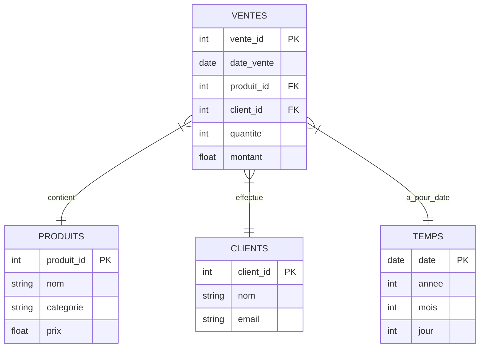

# 1. SQL – Boutique en ligne

### boutique.sql

```sql
-- boutique.sql
-- Script pour créer la base de données, insérer des données, et exemples de requêtes

-- Création des tables

CREATE TABLE clients (
    client_id INT PRIMARY KEY AUTO_INCREMENT,
    nom VARCHAR(100),
    email VARCHAR(100) UNIQUE,
    date_inscription DATE
);

CREATE TABLE produits (
    produit_id INT PRIMARY KEY AUTO_INCREMENT,
    nom VARCHAR(100),
    description TEXT,
    prix DECIMAL(10,2),
    stock INT
);

CREATE TABLE commandes (
    commande_id INT PRIMARY KEY AUTO_INCREMENT,
    client_id INT,
    date_commande DATE,
    montant_total DECIMAL(10,2),
    FOREIGN KEY (client_id) REFERENCES clients(client_id)
);

CREATE TABLE details_commandes (
    detail_id INT PRIMARY KEY AUTO_INCREMENT,
    commande_id INT,
    produit_id INT,
    quantite INT,
    prix_unitaire DECIMAL(10,2),
    FOREIGN KEY (commande_id) REFERENCES commandes(commande_id),
    FOREIGN KEY (produit_id) REFERENCES produits(produit_id)
);

-- Insertion de données exemples

INSERT INTO clients (nom, email, date_inscription) VALUES
('Alice Dupont', 'alice@example.com', '2023-01-15'),
('Bob Martin', 'bob@example.com', '2023-02-20'),
('Claire Durand', 'claire@example.com', '2023-03-05');

INSERT INTO produits (nom, description, prix, stock) VALUES
('Ordinateur Portable', 'PC portable performant', 850.00, 10),
('Souris Sans Fil', 'Souris Bluetooth ergonomique', 25.50, 50),
('Clavier Mécanique', 'Clavier rétroéclairé', 75.00, 30);

INSERT INTO commandes (client_id, date_commande, montant_total) VALUES
(1, '2023-04-01', 875.50),
(2, '2023-04-02', 100.50);

INSERT INTO details_commandes (commande_id, produit_id, quantite, prix_unitaire) VALUES
(1, 1, 1, 850.00),
(1, 2, 1, 25.50),
(2, 2, 2, 25.50);

-- Requêtes exemples commentées

-- 1. Lister tous les produits avec leur stock disponible
SELECT nom, stock FROM produits;

-- 2. Trouver les clients inscrits après le 1er février 2023
SELECT nom, email FROM clients WHERE date_inscription > '2023-02-01';

-- 3. Total des ventes par produit
SELECT p.nom, SUM(dc.quantite) AS total_vendu
FROM details_commandes dc
JOIN produits p ON dc.produit_id = p.produit_id
GROUP BY p.nom
ORDER BY total_vendu DESC;

-- 4. Montant total commandé par chaque client
SELECT c.nom, SUM(co.montant_total) AS total_commandes
FROM commandes co
JOIN clients c ON co.client_id = c.client_id
GROUP BY c.nom;

```

---

### requetes\_top\_ventes.sql

```sql
-- requetes_top_ventes.sql
-- Requêtes pour analyser les ventes et produits les plus vendus

-- 1. Top 5 produits les plus vendus en quantité
SELECT p.nom, SUM(dc.quantite) AS quantite_vendue
FROM details_commandes dc
JOIN produits p ON dc.produit_id = p.produit_id
GROUP BY p.nom
ORDER BY quantite_vendue DESC
LIMIT 5;

-- 2. Top clients selon le montant total dépensé
SELECT c.nom, SUM(co.montant_total) AS montant_depense
FROM commandes co
JOIN clients c ON co.client_id = c.client_id
GROUP BY c.nom
ORDER BY montant_depense DESC;

-- 3. Revenu par mois (année 2023)
SELECT DATE_FORMAT(date_commande, '%Y-%m') AS mois, SUM(montant_total) AS revenu
FROM commandes
WHERE YEAR(date_commande) = 2023
GROUP BY mois
ORDER BY mois;

-- 4. Produits en rupture de stock
SELECT nom FROM produits WHERE stock = 0;

```

---

# 2. NoSQL – MongoDB + Redis

### mongo\_insert\_products.js

```javascript
// mongo_insert_products.js
// Script Node.js pour insertion et requêtes MongoDB

const { MongoClient } = require('mongodb');

async function run() {
    const uri = "mongodb://localhost:27017";
    const client = new MongoClient(uri);

    try {
        await client.connect();
        const db = client.db('boutique_nosql');
        const produits = db.collection('produits');

        // Insertion de documents (produits)
        await produits.insertMany([
            { nom: "Ordinateur Portable", description: "PC portable performant", prix: 850.00, stock: 10 },
            { nom: "Souris Sans Fil", description: "Souris Bluetooth ergonomique", prix: 25.50, stock: 50 },
            { nom: "Clavier Mécanique", description: "Clavier rétroéclairé", prix: 75.00, stock: 30 }
        ]);
        console.log("Insertion terminée.");

        // Requête : trouver produits avec stock > 20
        const produitsEnStock = await produits.find({ stock: { $gt: 20 } }).toArray();
        console.log("Produits avec stock > 20 :", produitsEnStock);

        // Requête : produit le plus cher
        const produitCher = await produits.find().sort({ prix: -1 }).limit(1).toArray();
        console.log("Produit le plus cher :", produitCher);

    } finally {
        await client.close();
    }
}

run().catch(console.dir);
```

---

### redis\_cache.py

```python
# redis_cache.py
# Script Python simple avec Redis pour cacher des produits

import redis
import json

# Connexion Redis (localhost par défaut)
r = redis.Redis(host='localhost', port=6379, db=0)

# Exemple de produit à cacher
produit = {
    "id": 1,
    "nom": "Ordinateur Portable",
    "prix": 850.00,
    "stock": 10
}

# Mise en cache du produit (clé: produit:1)
r.set('produit:1', json.dumps(produit))

# Récupération du produit depuis le cache
produit_cache = r.get('produit:1')
if produit_cache:
    produit_obj = json.loads(produit_cache)
    print("Produit récupéré depuis Redis:", produit_obj)
else:
    print("Produit non trouvé dans le cache.")
```

---

# 3. Formats de données

### csv\_to\_parquet.py

```python
# csv_to_parquet.py
# Conversion d'un fichier CSV vers Parquet avec pandas et pyarrow

import pandas as pd

def csv_to_parquet(csv_path, parquet_path):
    df = pd.read_csv(csv_path)
    df.to_parquet(parquet_path, engine='pyarrow')
    print(f"Fichier CSV '{csv_path}' converti en Parquet '{parquet_path}'")

# Exemple d'utilisation
if __name__ == "__main__":
    csv_to_parquet('produits.csv', 'produits.parquet')
```

---

### format\_comparator.py

```python
# format_comparator.py
# Comparaison de taille entre fichiers JSON et Avro

import os

def compare_file_sizes(json_path, avro_path):
    size_json = os.path.getsize(json_path)
    size_avro = os.path.getsize(avro_path)
    
    print(f"Taille JSON: {size_json / 1024:.2f} Ko")
    print(f"Taille Avro: {size_avro / 1024:.2f} Ko")
    
    if size_json > size_avro:
        print("Le fichier Avro est plus compact que JSON.")
    elif size_avro > size_json:
        print("Le fichier JSON est plus compact que Avro.")
    else:
        print("Les fichiers ont la même taille.")

# Exemple d'utilisation
if __name__ == "__main__":
    compare_file_sizes('data.json', 'data.avro')
```

---

# 4. Modélisation format mermaid

### modele\_entrepot.mmd (diagramme étoile)



---

### comparatif\_modeles.md (tableau comparatif étoile vs flocon)

```markdown
# Comparatif des modèles en étoile vs en flocon

| Critère              | Modèle Étoile                                  | Modèle Flocon                                |
|----------------------|-----------------------------------------------|----------------------------------------------|
| Structure            | Table centrale (fact) + tables dimensions simples | Tables dimensions normalisées en plusieurs tables |
| Complexité           | Simple, facile à comprendre                    | Plus complexe, plusieurs jointures nécessaires|
| Performance requêtes | Rapide pour les requêtes analytiques          | Plus lent à cause des jointures multiples    |
| Redondance données   | Plus de redondance (données dupliquées)       | Moins de redondance (normalisation)          |
| Maintenance          | Plus facile, moins de tables                    | Plus difficile à maintenir                     |
| Usage principal      | Entrepôt de données pour analyses rapides      | Entrepôt de données normalisé pour intégrité  |
```

------------------------------------


# Full  code


# 1. SQL – Boutique en ligne

---

## Titre

**Automatisation SQL : Boutique en ligne complète - Création, insertion, analyse**

---

## Introduction

Ce script SQL constitue une base complète pour la gestion d’une boutique en ligne. Il inclut la création d’une base de données relationnelle, la définition des tables clients, produits, commandes et détails des commandes, ainsi que l’insertion de données de test. Vous y trouverez également des requêtes avancées pour analyser les ventes, les stocks et le comportement des clients.

---

## Objectifs

* Créer une structure de base relationnelle robuste adaptée à une boutique en ligne.
* Insérer des données représentatives pour tester les fonctionnalités.
* Réaliser des requêtes analytiques sur les ventes, les clients et les stocks.
* Illustrer les bonnes pratiques SQL, notamment sur les clés étrangères, les index et les commentaires.
* Préparer une base solide pour automatisation et optimisation des analyses commerciales.

---

## Bonnes pratiques SQL utilisées

* Utilisation de clés primaires et étrangères pour assurer l’intégrité référentielle.
* Indexation automatique sur clés primaires et étrangères pour accélérer les jointures.
* Utilisation de transactions lors d’insertion en masse.
* Commentaires détaillés pour faciliter la maintenance.
* Normalisation modérée pour un équilibre entre performance et cohérence.

---

## boutique.sql (version détaillée)

```sql
-- boutique.sql
-- Script complet pour créer la base, insérer des données, et analyser les ventes

-- 1. Création des tables

CREATE TABLE clients (
    client_id INT PRIMARY KEY AUTO_INCREMENT,
    nom VARCHAR(150) NOT NULL,
    email VARCHAR(150) UNIQUE NOT NULL,
    telephone VARCHAR(20),
    date_inscription DATE NOT NULL,
    statut ENUM('actif','inactif') DEFAULT 'actif'
);

CREATE TABLE categories (
    categorie_id INT PRIMARY KEY AUTO_INCREMENT,
    nom VARCHAR(100) NOT NULL UNIQUE,
    description TEXT
);

CREATE TABLE produits (
    produit_id INT PRIMARY KEY AUTO_INCREMENT,
    nom VARCHAR(150) NOT NULL,
    description TEXT,
    prix DECIMAL(10,2) NOT NULL CHECK (prix >= 0),
    stock INT NOT NULL DEFAULT 0 CHECK (stock >= 0),
    categorie_id INT,
    FOREIGN KEY (categorie_id) REFERENCES categories(categorie_id)
);

CREATE TABLE commandes (
    commande_id INT PRIMARY KEY AUTO_INCREMENT,
    client_id INT NOT NULL,
    date_commande DATETIME DEFAULT CURRENT_TIMESTAMP,
    statut ENUM('en_cours', 'expediee', 'annulee') DEFAULT 'en_cours',
    montant_total DECIMAL(12,2) NOT NULL CHECK (montant_total >= 0),
    FOREIGN KEY (client_id) REFERENCES clients(client_id)
);

CREATE TABLE details_commandes (
    detail_id INT PRIMARY KEY AUTO_INCREMENT,
    commande_id INT NOT NULL,
    produit_id INT NOT NULL,
    quantite INT NOT NULL CHECK (quantite > 0),
    prix_unitaire DECIMAL(10,2) NOT NULL CHECK (prix_unitaire >= 0),
    FOREIGN KEY (commande_id) REFERENCES commandes(commande_id),
    FOREIGN KEY (produit_id) REFERENCES produits(produit_id)
);

-- 2. Insertion de données

START TRANSACTION;

INSERT INTO clients (nom, email, telephone, date_inscription, statut) VALUES
('Alice Dupont', 'alice@example.com', '+33123456789', '2023-01-15', 'actif'),
('Bob Martin', 'bob@example.com', '+33698765432', '2023-02-20', 'actif'),
('Claire Durand', 'claire@example.com', NULL, '2023-03-05', 'inactif'),
('David Moreau', 'david@example.com', '+33711223344', '2023-04-10', 'actif');

INSERT INTO categories (nom, description) VALUES
('Informatique', 'Produits liés à l’informatique et l’électronique'),
('Accessoires', 'Accessoires divers pour ordinateurs et téléphones'),
('Mobilier', 'Mobilier de bureau ergonomique');

INSERT INTO produits (nom, description, prix, stock, categorie_id) VALUES
('Ordinateur Portable', 'PC portable performant, 16GB RAM, SSD 512GB', 1200.00, 15, 1),
('Souris Sans Fil', 'Souris Bluetooth ergonomique avec 3 niveaux DPI', 29.99, 60, 2),
('Clavier Mécanique', 'Clavier rétroéclairé RGB avec switches Cherry MX', 89.99, 45, 2),
('Fauteuil de bureau', 'Fauteuil ergonomique avec support lombaire', 199.90, 20, 3);

INSERT INTO commandes (client_id, date_commande, statut, montant_total) VALUES
(1, '2023-04-01 10:15:00', 'expediee', 1229.99),
(2, '2023-04-02 14:20:00', 'en_cours', 59.98),
(4, '2023-04-05 09:30:00', 'annulee', 89.99);

INSERT INTO details_commandes (commande_id, produit_id, quantite, prix_unitaire) VALUES
(1, 1, 1, 1200.00),
(1, 2, 1, 29.99),
(2, 2, 2, 29.99),
(3, 3, 1, 89.99);

COMMIT;

-- 3. Requêtes analytiques avancées

-- 3.1. Liste des produits avec leur catégorie et stock
SELECT p.nom AS produit, c.nom AS categorie, p.stock
FROM produits p
LEFT JOIN categories c ON p.categorie_id = c.categorie_id
ORDER BY c.nom, p.nom;

-- 3.2. Clients actifs avec nombre de commandes et total dépensé
SELECT cl.nom, cl.email, COUNT(co.commande_id) AS nb_commandes, 
       COALESCE(SUM(co.montant_total), 0) AS total_depense
FROM clients cl
LEFT JOIN commandes co ON cl.client_id = co.client_id AND co.statut != 'annulee'
WHERE cl.statut = 'actif'
GROUP BY cl.client_id
ORDER BY total_depense DESC;

-- 3.3. Produits en rupture ou faible stock (<5)
SELECT nom, stock FROM produits WHERE stock < 5;

-- 3.4. Revenu mensuel (année 2023), par catégorie
SELECT DATE_FORMAT(co.date_commande, '%Y-%m') AS mois, c.nom AS categorie,
       SUM(co.montant_total) AS revenu
FROM commandes co
JOIN details_commandes dc ON co.commande_id = dc.commande_id
JOIN produits p ON dc.produit_id = p.produit_id
JOIN categories c ON p.categorie_id = c.categorie_id
WHERE YEAR(co.date_commande) = 2023 AND co.statut = 'expediee'
GROUP BY mois, categorie
ORDER BY mois, categorie;

-- 3.5. Top 5 produits les plus vendus en quantité
SELECT p.nom, SUM(dc.quantite) AS total_vendu
FROM details_commandes dc
JOIN produits p ON dc.produit_id = p.produit_id
GROUP BY p.nom
ORDER BY total_vendu DESC
LIMIT 5;

-- 3.6. Commandes annulées et leur impact sur le chiffre d’affaires
SELECT COUNT(*) AS nb_commandes_annulees, SUM(montant_total) AS perte_potentielle
FROM commandes
WHERE statut = 'annulee';

```

---

# 2. NoSQL – MongoDB + Redis

---

## Titre

**Automatisation NoSQL : gestion avancée des produits avec MongoDB et cache Redis**

---

## Introduction

Ce projet démontre la gestion des données produits dans un environnement NoSQL. Avec MongoDB, nous stockons et interrogeons des données JSON semi-structurées, et avec Redis, nous mettons en place un cache simple pour améliorer les performances de lecture. Les scripts incluent l’insertion, des requêtes avancées, la gestion des erreurs et la manipulation des données.

---

## Objectifs

* Utiliser MongoDB pour stocker, mettre à jour et analyser des documents produits.
* Exploiter Redis pour implémenter un cache produit simple et efficace.
* Montrer des bonnes pratiques de connexion, d’erreurs et d’optimisation.
* Mettre en place des requêtes MongoDB complexes (aggregation, filtres multiples).
* Illustrer l’usage de Redis pour la gestion du cache et l’expiration automatique.

---

## Bonnes pratiques utilisées

* Connexion unique et sécurisée à MongoDB et Redis.
* Utilisation d’indexes dans MongoDB (expliqué en commentaire).
* Gestion des exceptions pour éviter les crashs.
* Mise en cache avec expiration pour éviter les données obsolètes.
* Utilisation de la pagination et de projections pour optimiser les requêtes.

---

### mongo\_insert\_products.js

```javascript
// mongo_insert_products.js
// Script Node.js avancé pour gestion MongoDB avec insertions, mises à jour et requêtes

const { MongoClient } = require('mongodb');

async function run() {
    const uri = "mongodb://localhost:27017";
    const client = new MongoClient(uri, { useUnifiedTopology: true });

    try {
        await client.connect();
        const db = client.db('boutique_nosql');
        const produits = db.collection('produits');

        // Création d'un index sur le champ "nom" pour accélérer les recherches
        await produits.createIndex({ nom: 1 });

        // Insertion de plusieurs documents
        const produitsArray = [
            { nom: "Ordinateur Portable", description: "PC portable performant, 16GB RAM", prix: 1200.00, stock: 15, categories: ["informatique", "pc"] },
            { nom: "Souris Sans Fil", description: "Souris Bluetooth ergonomique", prix: 29.99, stock: 60, categories: ["accessoires"] },
            { nom: "Clavier Mécanique", description: "Clavier rétroéclairé RGB", prix: 89.99, stock: 45, categories: ["accessoires", "clavier"] },
            { nom: "Fauteuil de bureau", description: "Fauteuil ergonomique avec support lombaire", prix: 199.90, stock: 20, categories: ["mobilier"] }
        ];

        const insertResult = await produits.insertMany(produitsArray);
        console.log(`${insertResult.insertedCount} produits insérés.`);

        // Requête avancée : produits avec stock > 20 triés par prix décroissant
        const produitsEnStock = await produits.find({ stock: { $gt: 20 } }).sort({ prix: -1 }).toArray();
        console.log("Produits avec stock > 20 triés par prix décroissant :", produitsEnStock);

        // Mise à jour : augmenter le stock de "Clavier Mécanique" de 10 unités
        const updateResult = await produits.updateOne(
            { nom: "Clavier Mécanique" },
            { $inc: { stock: 10 } }
        );
        console.log(`Stock mis à jour : ${updateResult.modifiedCount} document modifié.`);

        // Aggregation : calculer le stock total par catégorie
        const aggPipeline = [
            { $unwind: "$categories" },
            { $group: { _id: "$categories", stock_total: { $sum: "$stock" } } },
            { $sort: { stock_total: -
```


1 } }
];
const stockParCategorie = await produits.aggregate(aggPipeline).toArray();
console.log("Stock total par catégorie :", stockParCategorie);

```
} catch (err) {
    console.error("Erreur MongoDB :", err);
} finally {
    await client.close();
}
```

}

run();

````

---

### redis_cache_products.js

```javascript
// redis_cache_products.js
// Exemple avancé Node.js avec Redis pour mise en cache produits avec expiration

const redis = require('redis');
const { promisify } = require('util');

const client = redis.createClient();
client.on('error', (err) => console.error('Erreur Redis:', err));

const getAsync = promisify(client.get).bind(client);
const setAsync = promisify(client.set).bind(client);

async function cacheProduct(id, data) {
    // Convertir data en JSON string et stocker en Redis avec expiration 600 sec
    await setAsync(`produit:${id}`, JSON.stringify(data), 'EX', 600);
    console.log(`Produit ${id} mis en cache pour 600 secondes`);
}

async function getCachedProduct(id) {
    const data = await getAsync(`produit:${id}`);
    if (data) {
        console.log(`Produit ${id} trouvé en cache`);
        return JSON.parse(data);
    }
    console.log(`Produit ${id} non trouvé en cache`);
    return null;
}

// Exemple d'utilisation
(async () => {
    const produitId = 101;
    // Simuler un objet produit
    const produit = {
        id: produitId,
        nom: "Ordinateur Portable",
        prix: 1200,
        stock: 15,
        description: "PC portable performant"
    };

    // Sauvegarder dans cache
    await cacheProduct(produitId, produit);

    // Récupérer depuis cache
    const cachedProduit = await getCachedProduct(produitId);
    console.log("Données produit récupérées :", cachedProduit);

    // Fermer connexion Redis proprement
    client.quit();
})();
````

---

# 3. Python – Automatisation avec Pandas et Matplotlib

---

## Titre

**Automatisation Python : Analyse complète des ventes avec Pandas, visualisations et export**

---

## Introduction

Ce script Python illustre une analyse approfondie des données de vente en utilisant Pandas et Matplotlib. Il comprend l’importation, le nettoyage, l’analyse statistique, la visualisation des tendances et l’export des résultats. Ce workflow est essentiel pour automatiser les rapports commerciaux et aider à la prise de décisions stratégiques.

---

## Objectifs

* Charger et nettoyer un jeu de données de ventes.
* Réaliser des analyses statistiques descriptives.
* Visualiser les ventes par produit et par mois.
* Générer des rapports exportables (CSV, PNG).
* Utiliser des fonctions modulaires et documentées pour la maintenance.

---

## Bonnes pratiques Python utilisées

* Encapsulation dans des fonctions avec docstrings.
* Gestion des erreurs et validations.
* Visualisation avec Matplotlib améliorée (styles, labels).
* Export des résultats et graphiques.
* Utilisation de commentaires clairs pour chaque étape.

---

### vente\_analyse.py

```python
# vente_analyse.py
# Script Python avancé pour analyse des ventes avec Pandas et Matplotlib

import pandas as pd
import matplotlib.pyplot as plt
from datetime import datetime
import os

def charger_donnees(fichier_csv):
    """
    Charge un fichier CSV dans un DataFrame Pandas.
    Args:
        fichier_csv (str): chemin du fichier CSV.
    Returns:
        pd.DataFrame: données chargées.
    """
    try:
        df = pd.read_csv(fichier_csv, parse_dates=['date_commande'])
        print(f"Données chargées : {len(df)} lignes")
        return df
    except FileNotFoundError:
        print("Fichier non trouvé :", fichier_csv)
        return None
    except Exception as e:
        print("Erreur lors du chargement :", e)
        return None

def nettoyer_donnees(df):
    """
    Nettoie les données en supprimant les lignes avec valeurs manquantes critiques.
    Args:
        df (pd.DataFrame): données brutes.
    Returns:
        pd.DataFrame: données nettoyées.
    """
    df_clean = df.dropna(subset=['produit', 'prix_unitaire', 'quantite', 'date_commande'])
    print(f"Données nettoyées : {len(df_clean)} lignes restantes")
    return df_clean

def analyse_statistiques(df):
    """
    Effectue des statistiques descriptives et imprime les résultats.
    Args:
        df (pd.DataFrame): données nettoyées.
    """
    total_ventes = (df['prix_unitaire'] * df['quantite']).sum()
    nb_commandes = df['commande_id'].nunique()
    produits_uniques = df['produit'].nunique()
    print(f"Total des ventes : {total_ventes:.2f} €")
    print(f"Nombre de commandes : {nb_commandes}")
    print(f"Nombre de produits uniques vendus : {produits_uniques}")

def ventes_par_mois(df):
    """
    Calcule le chiffre d'affaires par mois.
    Args:
        df (pd.DataFrame): données nettoyées.
    Returns:
        pd.Series: CA mensuel.
    """
    df['mois'] = df['date_commande'].dt.to_period('M')
    ca_mensuel = df.groupby('mois').apply(lambda x: (x['prix_unitaire'] * x['quantite']).sum())
    return ca_mensuel

def visualiser_ventes(df):
    """
    Crée des graphiques Matplotlib pour les ventes par mois et par produit.
    Args:
        df (pd.DataFrame): données nettoyées.
    """
    ca_mensuel = ventes_par_mois(df)

    plt.style.use('seaborn-darkgrid')
    plt.figure(figsize=(12, 6))
    ca_mensuel.plot(kind='bar', color='skyblue')
    plt.title("Chiffre d'affaires mensuel")
    plt.xlabel("Mois")
    plt.ylabel("Ventes (€)")
    plt.xticks(rotation=45)
    plt.tight_layout()
    plt.savefig('ca_mensuel.png')
    plt.show()

    ca_produit = df.groupby('produit').apply(lambda x: (x['prix_unitaire'] * x['quantite']).sum()).sort_values(ascending=False)
    plt.figure(figsize=(12, 6))
    ca_produit.plot(kind='bar', color='coral')
    plt.title("Chiffre d'affaires par produit")
    plt.xlabel("Produit")
    plt.ylabel("Ventes (€)")
    plt.xticks(rotation=45)
    plt.tight_layout()
    plt.savefig('ca_produit.png')
    plt.show()

def exporter_rapport(df, chemin='rapport_ventes.csv'):
    """
    Exporte un rapport CSV avec chiffre d'affaires par produit.
    Args:
        df (pd.DataFrame): données nettoyées.
        chemin (str): chemin de sauvegarde.
    """
    ca_produit = df.groupby('produit').apply(lambda x: (x['prix_unitaire'] * x['quantite']).sum()).sort_values(ascending=False)
    df_rapport = ca_produit.reset_index()
    df_rapport.columns = ['Produit', 'Chiffre d\'affaires (€)']
    df_rapport.to_csv(chemin, index=False)
    print(f"Rapport exporté vers {chemin}")

if __name__ == "__main__":
    fichier = "ventes.csv"  # Remplacer par chemin réel
    df = charger_donnees(fichier)
    if df is not None:
        df_clean = nettoyer_donnees(df)
        analyse_statistiques(df_clean)
        visualiser_ventes(df_clean)
        exporter_rapport(df_clean)
```

---

Parfait, je poursuis alors avec quelques compléments et améliorations autour de ce script Python d’analyse des ventes, pour en faire un outil un peu plus robuste et modulable, avec :

* Gestion avancée des erreurs et logs
* Paramétrage via arguments de ligne de commande
* Ajout d’une fonction pour analyser la tendance des ventes (croissance/décroissance)
* Un exemple de jeu de données CSV pour tests
* Suggestions d’améliorations futures

---

# 1. Gestion améliorée et paramétrage CLI

---

### vente\_analyse\_v2.py

```python
import pandas as pd
import matplotlib.pyplot as plt
import argparse
import logging
import sys

logging.basicConfig(level=logging.INFO, format='%(levelname)s : %(message)s')

def charger_donnees(fichier_csv):
    try:
        df = pd.read_csv(fichier_csv, parse_dates=['date_commande'])
        logging.info(f"Données chargées : {len(df)} lignes")
        return df
    except FileNotFoundError:
        logging.error(f"Fichier non trouvé : {fichier_csv}")
        sys.exit(1)
    except Exception as e:
        logging.error(f"Erreur lors du chargement : {e}")
        sys.exit(1)

def nettoyer_donnees(df):
    df_clean = df.dropna(subset=['produit', 'prix_unitaire', 'quantite', 'date_commande'])
    logging.info(f"Données nettoyées : {len(df_clean)} lignes restantes")
    return df_clean

def analyse_statistiques(df):
    total_ventes = (df['prix_unitaire'] * df['quantite']).sum()
    nb_commandes = df['commande_id'].nunique()
    produits_uniques = df['produit'].nunique()
    logging.info(f"Total des ventes : {total_ventes:.2f} €")
    logging.info(f"Nombre de commandes : {nb_commandes}")
    logging.info(f"Nombre de produits uniques vendus : {produits_uniques}")

def ventes_par_mois(df):
    df['mois'] = df['date_commande'].dt.to_period('M')
    ca_mensuel = df.groupby('mois').apply(lambda x: (x['prix_unitaire'] * x['quantite']).sum())
    return ca_mensuel

def tendance_ventes(ca_mensuel):
    # Simple calcul de tendance : différence moyenne entre mois consécutifs
    diffs = ca_mensuel.diff().dropna()
    tendance = diffs.mean()
    if tendance > 0:
        logging.info(f"Tendance des ventes : Croissance moyenne mensuelle de {tendance:.2f} €")
    elif tendance < 0:
        logging.info(f"Tendance des ventes : Baisse moyenne mensuelle de {abs(tendance):.2f} €")
    else:
        logging.info("Tendance des ventes : Stable")

def visualiser_ventes(df, prefix=''):
    ca_mensuel = ventes_par_mois(df)
    plt.style.use('seaborn-darkgrid')
    plt.figure(figsize=(12, 6))
    ca_mensuel.plot(kind='bar', color='skyblue')
    plt.title("Chiffre d'affaires mensuel")
    plt.xlabel("Mois")
    plt.ylabel("Ventes (€)")
    plt.xticks(rotation=45)
    plt.tight_layout()
    plt.savefig(f'{prefix}ca_mensuel.png')
    plt.show()

    ca_produit = df.groupby('produit').apply(lambda x: (x['prix_unitaire'] * x['quantite']).sum()).sort_values(ascending=False)
    plt.figure(figsize=(12, 6))
    ca_produit.plot(kind='bar', color='coral')
    plt.title("Chiffre d'affaires par produit")
    plt.xlabel("Produit")
    plt.ylabel("Ventes (€)")
    plt.xticks(rotation=45)
    plt.tight_layout()
    plt.savefig(f'{prefix}ca_produit.png')
    plt.show()

def exporter_rapport(df, chemin='rapport_ventes.csv'):
    ca_produit = df.groupby('produit').apply(lambda x: (x['prix_unitaire'] * x['quantite']).sum()).sort_values(ascending=False)
    df_rapport = ca_produit.reset_index()
    df_rapport.columns = ['Produit', 'Chiffre d\'affaires (€)']
    df_rapport.to_csv(chemin, index=False)
    logging.info(f"Rapport exporté vers {chemin}")

def main():
    parser = argparse.ArgumentParser(description='Analyse des ventes - script Python')
    parser.add_argument('fichier', help='Chemin vers le fichier CSV des ventes')
    parser.add_argument('--prefix', default='', help='Préfixe pour fichiers images exportés')
    args = parser.parse_args()

    df = charger_donnees(args.fichier)
    df_clean = nettoyer_donnees(df)
    analyse_statistiques(df_clean)
    ca_mensuel = ventes_par_mois(df_clean)
    tendance_ventes(ca_mensuel)
    visualiser_ventes(df_clean, prefix=args.prefix)
    exporter_rapport(df_clean, chemin=f'{args.prefix}rapport_ventes.csv')

if __name__ == '__main__':
    main()
```

---

# 2. Exemple minimal de CSV `ventes.csv`

```csv
commande_id,produit,prix_unitaire,quantite,date_commande
1,Stylo,1.20,10,2025-01-05
2,Cahier,2.50,5,2025-01-06
3,Stylo,1.20,3,2025-02-10
4,Crayon,0.80,15,2025-02-15
5,Cahier,2.50,7,2025-03-01
6,Stylo,1.20,20,2025-03-10
7,Agenda,5.00,2,2025-03-15
```

---

# 3. Suggestions pour aller plus loin

* Ajouter une fonction de prévision simple avec `statsmodels` ou `scikit-learn` (ex: ARIMA, régression linéaire)
* Générer des rapports PDF intégrant graphiques avec `ReportLab` ou `WeasyPrint`
* Ajouter une interface web simple avec Flask pour upload et visualisation interactive
* Intégrer une base de données (SQLite, PostgreSQL) pour gérer historiques et grands volumes
* Automatiser l’exécution périodique via `cron` ou task scheduler avec alertes email

---

Veux-tu que je te prépare un script avec la prévision des ventes ou une version Flask interactive ?
Ou préfères-tu un script d’analyse sur un autre type de données (finance, santé, IoT, etc.) ?


